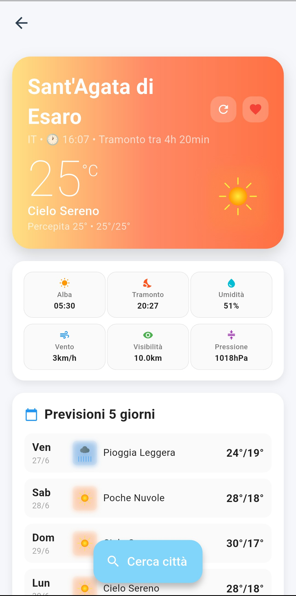

# Meteo App

**Nome:** Ivana Tolva  
**Matricola:** 338676

## Titolo del Progetto
Meteo - Applicazione mobile per previsioni meteorologiche con design responsive

## Panoramica del Progetto
Meteo è un'applicazione Flutter completa che fornisce informazioni meteorologiche dettagliate per città di tutto il mondo. L'app integra ricerca intelligente con suggerimenti automatici, visualizzazione del meteo attuale con icone personalizzate animate, previsioni dettagliate a 5 giorni, sistema di gestione città preferite con persistenza locale, supporto completo per temi chiaro/scuro e un design completamente responsive che si adatta automaticamente a smartphone, tablet e desktop. L'interfaccia utilizza animazioni Lottie e micro-interazioni per offrire un'esperienza utente moderna e coinvolgente.

## Panoramica dell'Esperienza Utente
L'utente accede all'app e trova una schermata di benvenuto con animazioni meteo. Toccando "Cerca città" si apre un overlay dove può digitare il nome della città (minimo 2 caratteri) e ricevere suggerimenti in tempo reale tramite geocoding API. Selezionando dalla lista o premendo "Cerca", viene mostrata una schermata completa con card meteo principale (temperatura, descrizione, icona animata), griglia informazioni dettagliate (alba/tramonto, umidità, vento, visibilità, pressione) e lista previsioni 5 giorni con temperature min/max. L'utente può salvare città nei preferiti tramite l'icona cuore e accedervi dal menu drawer laterale. Le città salvate sono accessibili dalla schermata preferiti dove si può visualizzare il meteo di tutte le città e rimuoverle. Il tema può essere cambiato tra chiaro e scuro dal drawer.

## Tecnologie

### Pacchetti Dart/Flutter utilizzati e motivazioni:
- **provider ^6.1.1:** Utilizzato per la gestione reattiva dello stato dell'applicazione. Scelto perché fornisce un pattern pulito per separare la logica di business dalla UI e permette aggiornamenti automatici dell'interfaccia quando i dati cambiano.
- **http ^1.1.0:** Per effettuare chiamate HTTP REST alle API di OpenWeatherMap. Scelto per la sua semplicità e affidabilità, soddisfa le necessità del progetto senza aggiungere complessità.
- **shared_preferences ^2.1.2:** Per la persistenza locale delle preferenze utente (tema selezionato, lista città preferite). Utilizzato perché è la soluzione standard Flutter per salvare dati semplici in modo permanente sul dispositivo.
- **lottie ^3.1.0:** Per le animazioni vettoriali nella schermata di benvenuto (sole, pioggia, neve, nuvole). Scelto perché offre animazioni fluide e scalabili senza impattare le performance.
- **flutter_launcher_icons ^0.13.1:** Per generare automaticamente l'icona dell'app su tutte le piattaforme partendo da un'unica immagine sorgente.

### Scelte implementative degne di nota:
**Architettura con Provider:** Implementata separazione completa tra UI, logica di business e dati. WeatherProvider gestisce stato meteo e API calls, ThemeProvider gestisce il tema, garantendo codice manutenibile e testabile.

**Design responsive avanzato:** Creato sistema di breakpoint multipli (mobile, tablet, desktop, wide-screen) con calcoli dinamici per dimensioni font, spaziature e layout. Gestione specifica per orientamento landscape e portrait.

**Icone meteo personalizzate:** Sviluppato sistema di icone meteo utilizzando CustomPainter invece di immagini statiche. Ogni icona è programmata con gradienti, animazioni e varianti giorno/notte, garantendo consistenza visiva e prestazioni ottimali.

### Memorizzazione dati e comunicazione server:
**Dati locali:** L'app utilizza SharedPreferences per salvare preferenza tema utente e lista città preferite. Le preferenze persistono tra sessioni dell'app.

**Comunicazione server:** L'app comunica con OpenWeatherMap API attraverso tre endpoint: Current Weather API per dati meteo attuali, Forecast API per previsioni 5 giorni, e Geocoding API per ricerca città con suggerimenti. Tutti i dati vengono richiesti in tempo reale per garantire informazioni aggiornate. Le chiamate API sono gestite dalla classe WeatherService dedicata.

### Problemi risolti durante l'implementazione:
**Overflow tastiera:** Risolto problema di overflow UI quando si apre la tastiera mobile implementando gestione dinamica con SingleChildScrollView e calcolo viewInsets.bottom per ridimensionare automaticamente il layout.

**Performance animazioni responsive:** Ottimizzate le animazioni Lottie per diversi dispositivi calcolando dinamicamente dimensioni e posizioni degli elementi in base alle dimensioni schermo.

**Gestione timezone:** Risolto problema di visualizzazione orari alba/tramonto implementando calcolo corretto del fuso orario locale della città utilizzando l'offset timezone fornito dall'API.

**Consistenza icone meteo:** Sviluppato sistema per garantire che le icone meteo siano sempre appropriate al momento della giornata, gestendo correttamente la logica giorno/notte basata su alba/tramonto locali.